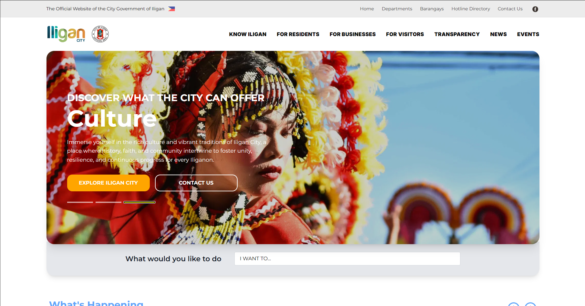
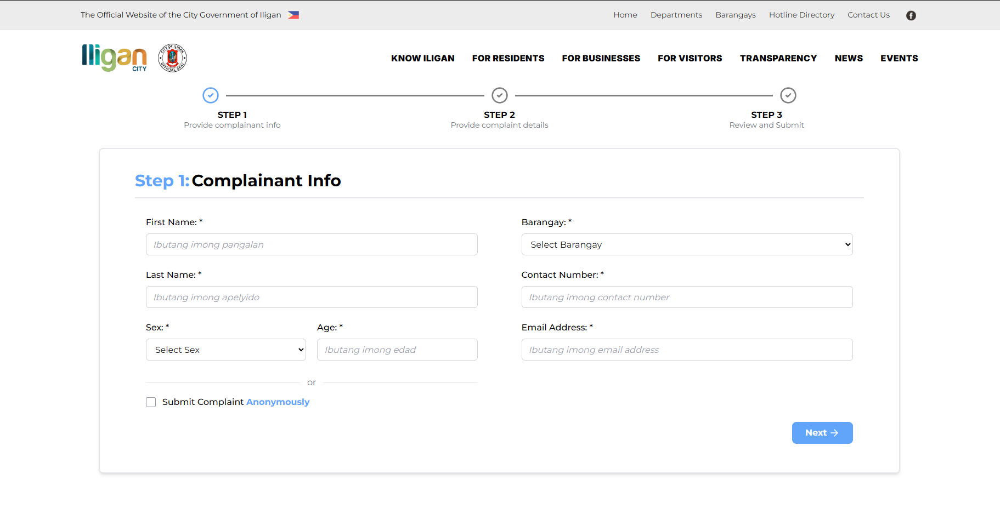
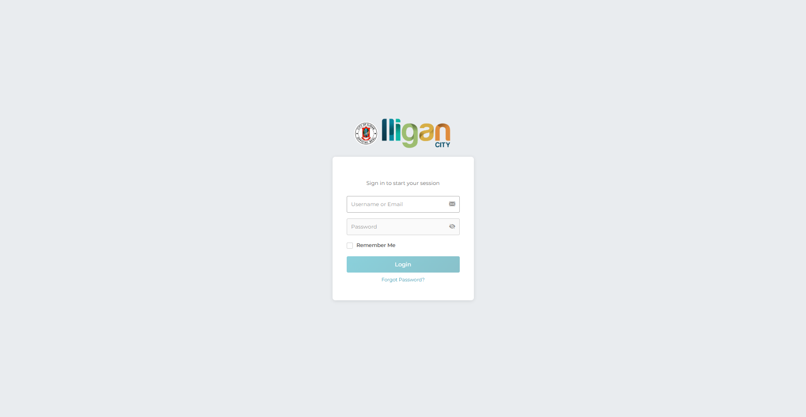
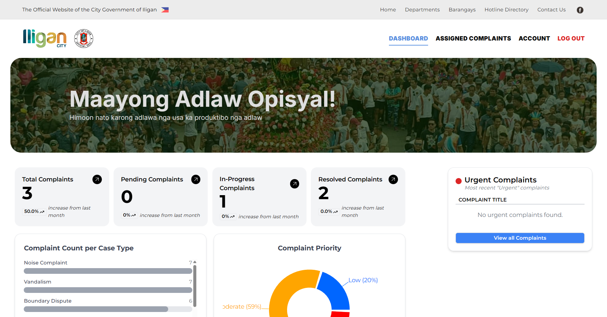

# iReklamo
### Iligan City Complaint Management System

**A centralized platform for filing, tracking, and managing complaints across all barangays of Iligan City.**

[📄 View Project Documentation](https://github.com/mustafamclngn/iReklamo/releases/tag/docs-v1.0)

---

## Overview

iReklamo is a full-stack complaint management web application built for the residents of Iligan City. The platform provides a streamlined way to submit and track complaints across all barangays, with dedicated portals for residents and barangay personnel.

The frontend is designed to mirror the visual identity of [iligan.gov.ph](https://iligan.gov.ph), ensuring a familiar and accessible experience for local residents.

---

## Features

### For Residents
- **Complaint Submission** — File complaints with supporting image evidence through an intuitive interface
- **Real-Time Tracking** — Monitor the status and progress of submitted complaints with live updates
- **Secure Authentication** — User accounts backed by a PostgreSQL authentication system

### For Administrators & Barangay Personnel
- **Admin Dashboard** — A comprehensive management panel to review, process, and resolve complaints
- **Dedicated Personnel Routes** — Separate login and account access for barangay officials
- **Complaint Overview** — View and manage all complaints filed within their jurisdiction

---

## Tech Stack

| Layer | Technology |
|---|---|
| Frontend | React.js, JavaScript (ES6), HTML, CSS |
| Backend | Flask (Python 3.13) |
| Database | PostgreSQL 17 |
| Image Storage | Supabase Bucket |
| Email Testing | Mailtrap |

---

## Screenshots

**Home Dashboard**

**Filing a Complaint**

**Personnel Login**

**Barangay Personnel Account**

---

## Contributors

| GitHub | Role |
|---|---|
| [@mustafamclngn](https://github.com/mustafamclngn) | Developer |
| [@daqhi](https://github.com/daqhi) | Developer |
| [@reness4nce](https://github.com/reness4nce) | Developer |
| [@fallerfare](https://github.com/fallerfare) | Developer |

---

## Acknowledgments

This project was developed as an academic requirement. Special thanks to the Iligan City government for design inspiration and to all contributors who made this project possible.

---

## License & Disclaimer

This project is for **academic and educational purposes only**. All rights reserved.

> ⚠️ iReklamo is a student project and is **not officially affiliated** with the Iligan City government.

---

## Contact

For questions or feedback, please [open an issue](https://github.com/mustafamclngn/iReklamo/issues) on GitHub.
